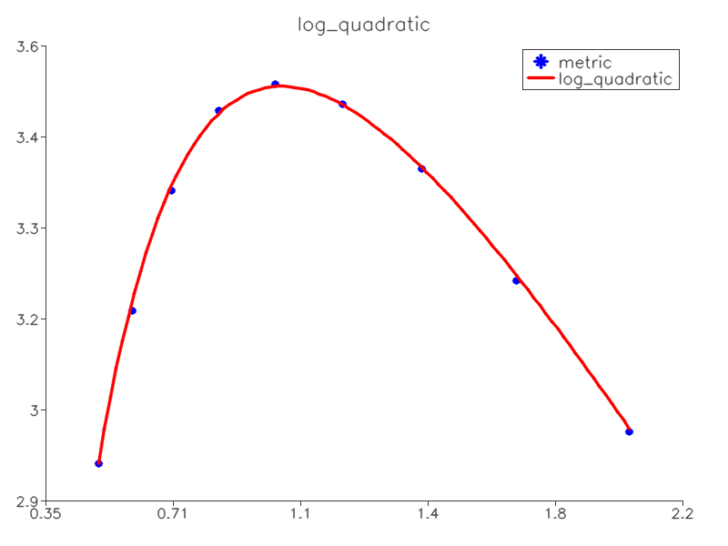

# aer_auto_exposure_gradient

## Description
This package is our implementation of Gradient based auto exposure by [Shim et al. 2018](https://ieeexplore.ieee.org/document/8379436). We have extended this algorithm to include rules for gain compensation and tested it on self driving car [Zeus.](https://www.autodrive.utoronto.ca/) We have subimitted our results to [17th Conference on Computer and Robot Vision](http://www.computerrobotvision.org/). This package interfaces with Blackfly S cameras (model number: BFSU3-51S5C-C) equipped with Sony IMX250 CMOS global shutter sensors with a 2448 by 2048 resolution and a 70.74 dB dynamic range.
## Installation 

This package was written for Black Fly series cameras. The setup guidlines for the camera drivers can be found [here](https://flir.app.boxcn.net/v/SpinnakerSDK) and in order to setup ros interface for the cameras use [this](https://github.com/ros-drivers/flir_camera_driver).
In order to install this package simply clone the repo and do `catkin build`. Note: This package was developed and tested on ROS Kinetic.

## Usage
In order to use the package follow these instructions:

1. Update the config file with the relevant parameters like the name of image topic, frame rate etc.
2. Launch the ros camera driver in order to get images from your camera.
3. Then use `roslaunch aer_auto_exposure_gradient exp_node.launch`.

## Video

Click on the image below for video.

## Detailed algorithm description

The algorithm has two parts - metric and optimizer. The metric is taken from the original repo, created by the Shim et. al. The optimizer has been changed from the Shim's to the more simple gradient descent optimizer, Original Shim's optimizer can be enabled instead of the our gradient-descent one, but it was not thoroughly tested, since the gradient descent based optimizer works well. Also the function used for fitting the effect of simulated gamma correction value on the metric has been changed from the Shim's fifth order polynomial to the more predictable log-quadratic function.

Output of the optimizer has also been modified and expanded. The optimizer is now internally working in the 0 to 1 range. That value is them mapped to the three possible "actuators" - camera's shutter speed (a.k.a. exposure time), camera's gain and special one - desired output power of the auxiliary LED illuminator. This reflects the intended usage - Visual-inertial odometry on the UAV in challenging lighting conditions, including complete darkness.

